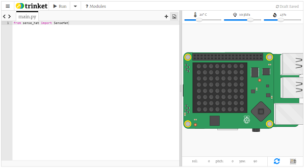
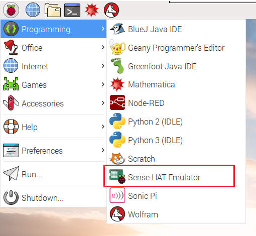

إذا لم تتمكن من الوصول إلى Sense HAT ، يمكنك استخدام المحاكي.

### محاكي Sense HAT المتصل بالإنترنت

هناك محاكي عبر الإنترنت يمكنك استخدامه في متصفحك لكتابة واختبار التعليمات البرمجية لـ Sense HAT.



+ افتح متصفح إنترنت ، انتقل إلى [https://trinket.io/sense-hat](https://trinket.io/sense-hat){:target="_blank"} وقم بحذف التعليمة البرمجية التنفيذية الموجودة في المحرر.

+ إذا كنت تريد حفظ عملك ، فستحتاج إلى [إنشاء حساب مجاني ](https://trinket.io/signup){:target="_blank"} على موقع Trinket الإلكتروني.

### محاكي Sense HAT على Raspberry Pi

إذا كنت تستخدم Raspberry Pi ، فهناك محاكي Sense HAT متضمن في نظام التشغيل Raspbian.



+ من القائمة الرئيسية ، حدد **Programming** > **محاكي Sense HAT** لفتح نافذة تحتوي على المحاكي.

+ إذا كنت تستخدم هذا الإصدار من المحاكي ، فيجب استيراد برنامجك من `sense_emu` بدلاً من `sense_hat`:

```python
from sense_emu import SenseHat
```

إذا كنت ترغب في وقت لاحق في تشغيل التعليمات البرمجية الخاصة بك على Sense HAT حقيقي ، فما عليك سوى تغيير مسار الاستيراد كما هو موضح أدناه. يمكن أن تبقى كافة التعليمات البرمجية الأخرى كما هي بالضبط.

```python
from sense_hat import SenseHat
```
