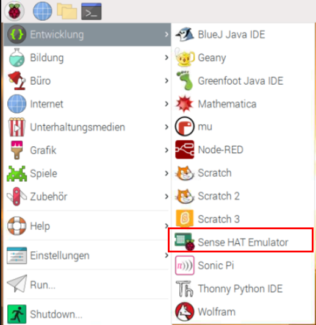

Wenn du keinen Zugriff auf einen Sense HAT hast, kannst du den Emulator verwenden.

### Online Sense HAT-Emulator

Es gibt einen Online-Emulator, mit dem du in deinem Browser Code für den Sense HAT schreiben und testen kannst.


+ Öffne einen Internetbrowser und gehe zu [https://trinket.io/sense-hat](https://trinket.io/sense-hat){:target="_ blank"} und lösche den vorhandenen Demo-Code, der sich im Editor befindet.

+ Wenn du deine Arbeit speichern möchtest, musst du auf der Trinket-Website [ein kostenloses Konto erstellen](https://trinket.io/signup){:target="_ blank"}.

### Sense HAT-Emulator auf dem Raspberry Pi

Wenn du einen Raspberry Pi verwendest, ist im Raspbian-Betriebssystem ein Sense HAT-Emulator enthalten.



+ Wähle im Hauptmenü **Entwicklung** > **Sense HAT Emulator** um ein Fenster mit dem Emulator zu öffnen.

+ Wenn du diese Version des Emulators verwendest, muss du dein Programm aus `sense_emu` importieren anstelle von `sense_hat`:

```python
from sense_emu import SenseHat
```

Wenn du den Code später auf einem echten Sense HAT ausführen möchten, änderst du einfach die Importzeile wie unten gezeigt. Aller anderer Code kann genau gleich bleiben.

```python
from sense_hat import SenseHat
```
