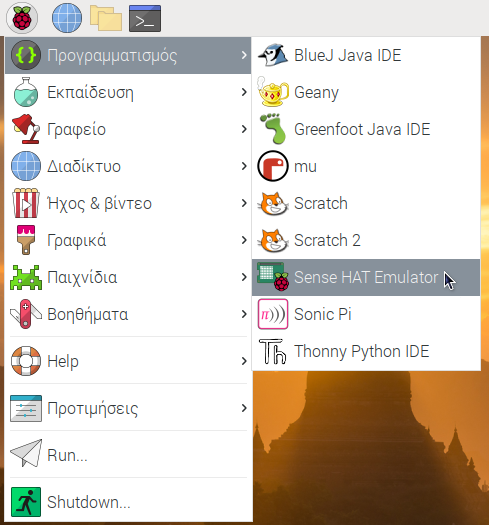

Εάν δεν έχεις πρόσβαση στο Sense HAT, μπορείς να χρησιμοποιήσεις τον εξομοιωτή.

### Εξομοιωτής Sense HAT σε σύνδεση

Υπάρχει ένας εξομοιωτής σε σύνδεση που μπορείς να χρησιμοποιήσεις στο πρόγραμμα περιήγησής σου για να γράψεις και να δοκιμάσεις κώδικα για το Sense HAT.


+ Άνοιξε ένα πρόγραμμα περιήγησης, μετακινήσου στη διεύθυνση [https://trinket.io/sense-hat](https://trinket.io/sense-hat){:target="_blank"} και διέγραψε τον υπάρχοντα κώδικα επίδειξης που υπάρχει στο πρόγραμμα επεξεργασίας.

+ Εάν θέλεις να αποθηκεύσεις την εργασία σου, θα πρέπει να [δημιουργήσεις έναν δωρεάν λογαριασμό](https://trinket.io/signup){:target="_blank"} στον ιστότοπο του Trinket.

### Εξομοιωτής Sense HAT στο Raspberry Pi

Εάν χρησιμοποιείς ένα Raspberry Pi, υπάρχει ένας εξομοιωτής Sense HAT που περιλαμβάνεται στο λειτουργικό σύστημα Raspbian.



+ Από το κύριο μενού, επίλεξε **Προγραμματισμός** > **Εξομοιωτής Sense HAT** για να ανοίξεις ένα παράθυρο που περιέχει τον εξομοιωτή.

+ Εάν χρησιμοποιείς αυτήν την έκδοση του εξομοιωτή, το πρόγραμμά σου πρέπει να εισαγάγει από `sense_emu` αντί για `sense_hat`:

```python
from sense_emu import SenseHat
```

Εάν αργότερα θέλεις να εκτελέσεις τον κώδικά σου σε πραγματικό Sense HAT, απλώς άλλαξε τη γραμμή εισαγωγής όπως φαίνεται παρακάτω. Όλος ο άλλος κωδικός μπορεί να παραμείνει ακριβώς ο ίδιος.

```python
from sense_hat import SenseHat
```
