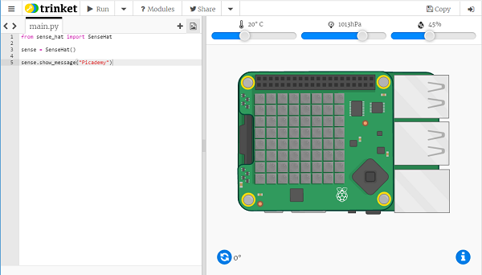

If you don’t have access to a Sense HAT, you can use the emulator.

### Sense HAT online emulator

There is an online emulator you can use to code the Sense HAT in your browser.



+ Open an internet browser and go to  [https://trinket.io/sense-hat](https://trinket.io/sense-hat){:target="_blank"}

+ If you would like to save your work, you will need to [create a free account](https://trinket.io/signup){:target="_blank"} on trinket.io

### Sense HAT emulator on Raspberry Pi

If you are using a Raspberry Pi, there is a Sense HAT emulator included with Raspbian.


+ From the main menu, select **Programming** > **Sense HAT emulator** to open a window containing the emulator.

+ If you are using this version of the emulator, you must import from `sense_emu` instead of `sense_hat`:

```python
from sense_emu import SenseHat
```

If you later want to run your code on a real Sense HAT, just change the import line back. All other code remains exactly the same. 

```python
from sense_hat import SenseHat
```
