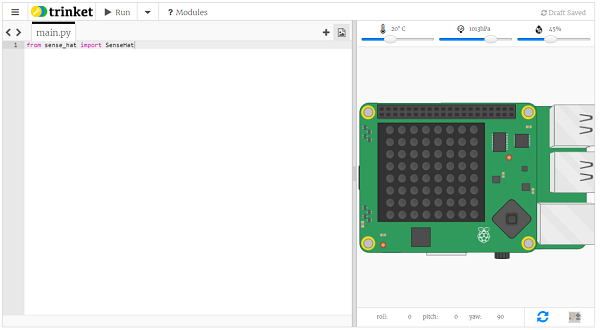

Si no tienes acceso a un Sense HAT, puedes usar el emulador.

### Emulador de Sense HAT en línea

Hay un emulador en línea que puedes usar en tu navegador para escribir y probar el código para el Sense HAT.



+ Abre un navegador de Internet, ve a [https://trinket.io/sense-hat ](https://trinket.io/sense-hat){:target="_ blank"} y elimina el código de demostración existente que está en el editor.

+ Si quieres guardar tu trabajo, deberás [crear una cuenta gratuita](https://trinket.io/signup){:target="_ blank"} en el sitio web de Trinket.

### Emulador de Sense HAT en la Raspberry Pi

Si estás utilizando una Raspberry Pi, hay un emulador de Sense HAT incluido en el sistema operativo Raspbian.


+ En el menú principal, selecciona **Programación** > **Sense HAT emulator** para abrir una ventana que contiene el emulador.

+ Si estás utilizando esta versión del emulador, tu programa debe importar desde `sense_emu ` en lugar de `sense_hat`:

```python
from sense_emu import SenseHat
```

Si luego deseas ejecutar tu código en un Sense HAT real, simplemente cambia la línea de importación como se muestra a continuación. El resto del código puede permanecer exactamente igual.

```python
from sense_hat import SenseHat
```
