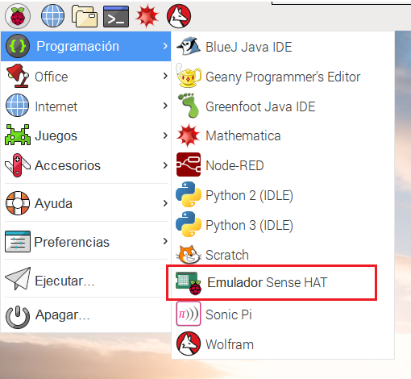

Si no tienes acceso a un Sense HAT, puedes utilizar el emulador.

### Emulador en línea de Sense HAT

Hay un emulador en línea que puedes usar en tu navegador web para escribir y probar el código para el Sense HAT.


+ Abre el navegador web de internet, entra a [https://trinket.io/sense-hat](https://trinket.io/sense-hat){:target="_blank"} y borra el código de demostración que se encuentra en el editor.

+ Si deseas guardar tu trabajo, tendrás que [crear una cuenta gratuita](https://trinket.io/signup){:target="_blank"} en la página web de Trinket.

### Emulador de Sense HAT en Raspberry Pi

Si estás utilizando Raspberry Pi, hay un emulador Sense HAT incluido en el sistema operativo Raspbian.



+ Desde el menú principal selecciona **Programación** > **emulador Sense HAT** para abrir la ventana que contiene al emulador.

+ Si estás usando esta versión del emulador, tu programa debe importarse desde `sense_emu` en lugar de `sense_hat`:

```python
from sense_emu import SenseHat
```

Si después quieres ejecutar tu código en un Sense HAT real, solo tendrás que cambiar la línea import como se muestra abajo. El resto del código puede permanecer exactamente igual.

```python
from sense_hat import SenseHat
```
