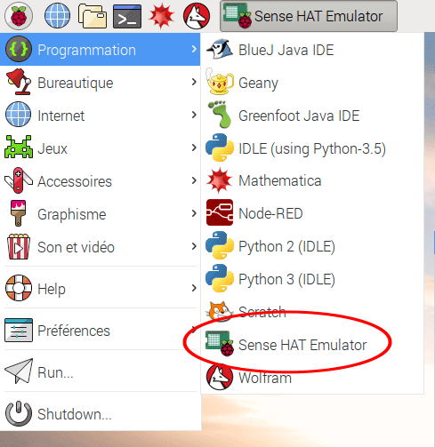

Si tu n'as pas accès à un Sense HAT, tu peux utiliser l'émulateur.

### Émulateur Sense HAT en ligne

Il existe un émulateur en ligne que tu peux utiliser dans ton navigateur pour écrire et tester le code du Sense HAT.


+ Ouvre un navigateur Internet, va sur [https://trinket.io/sense-hat](https://trinket.io/sense-hat){:target="_blank"} et supprime le code démo existant qui se trouve dans l'éditeur.

+ Si tu souhaites enregistrer ton travail, tu devras [créer un compte gratuit](https://trinket.io/signup){:target="_blank"} sur le site Web Trinket.

### Émulateur Sense HAT sur le Raspberry Pi

Si tu utilises un Raspberry Pi, un émulateur Sense HAT est inclus dans le système d'exploitation Raspbian.



+ Dans le menu principal, sélectionne **Programmation** > **Sense HAT Emulator** pour ouvrir une fenêtre contenant l'émulateur.

+ Si tu utilises cette version de l'émulateur, ton programme doit importer à partir de `sense_emu` au lieu de `sense_hat` :

```python
from sense_emu import SenseHat
```

Si tu souhaites par la suite exécuter ton code sur un vrai Sense HAT, change simplement la ligne d'importation comme indiqué ci-dessous. Tous les autres codes peuvent rester exactement les mêmes.

```python
from sense_hat import SenseHat
```
