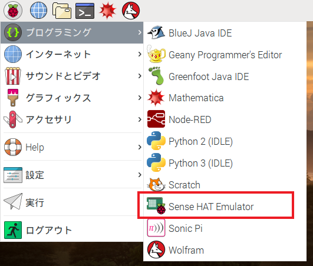

Sense HATが使えない場合は、エミュレータが使えます。

### オンラインのSense HATエミュレータ

Sense HATのコードを書いたり試したりするためにブラウザで使えるオンラインのエミュレータがあります。


+ インターネットブラウザを開いて[https://trinket.io/sense-hat](https://trinket.io/sense-hat){:target="_blank"} に移動し、エディタに書かれているデモコードを消します。

+ 書いたコードを保存したい場合は、Trinketのウェブサイトで[無料のアカウントを作成する](https://trinket.io/signup){:target="_blank"}必要があります。

### Raspberry Piで動くSense HATエミュレータ

Raspberry Piを使う場合は、Raspberry Pi OSにSense HATエミュレータがあります。



+ メインメニューから**プログラミング** > **Sense HAT Emulator**を選び、エミュレータウィンドウを開きます。

+ このバージョンのエミュレータを使う場合は、プログラムで`sense_hat`からインポートするかわりに`sense_emu`からインポートしなければなりません。

```python
from sense_emu import SenseHat
```

後で実物のSense HATでコードを実行したい場合は、インポートしている行を以下のように変更するだけです。 他のコードはすべてそのままで良いです。

```python
from sense_hat import SenseHat
```
