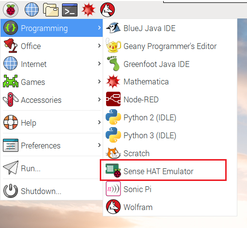

Sense Hat을 사용할 수 없는 경우, 에뮬레이터를 사용할 수 있습니다.

### 온라인 Sense Hat 에뮬레이터

Sense Hat에 대한 코드를 작성하고 테스트하기 위해 브라우저에서 사용할 수 있는 에뮬레이터가 있습니다.


+ 인터넷 브라우저를 열고, [https://trinket.io/sense-hat](https://trinket.io/sense-hat){:target="_blank"} 으로 이동합니다. 편집기에 있는 데모 코드를 삭제합니다.

+ 작업 내용을 저장하려면, Trinket 웹사이트에서 [무료 계정](https://trinket.io/signup){:target="_blank"} 을 만들어야 합니다.

### Raspberry Pi에서의 Sense Hat 에뮬레이터

Raspberry Pi를 사용하는 경우, Raspbian 운영체제 안에 Sense Hat 에뮬레이터가 있습니다.



+ 메인 메뉴에서 **프로그래밍** > **Sense Hat 에뮬레이터** 를 선택하여 에뮬레이터를 실행합니다.

+ 이 버전의 에뮬레이터를 사용하는 경우, Python 프로그램은 `sense_hat` 대신 `sense_emu` 라이브러리를 import 해야 합니다.

```python
from sense_emu import SenseHat
```

나중에 실제 Sense HAT에서 코드를 실행하려면 아래 표시된대로 import 행을 변경하세요. 다른 모든 코드는 정확히 동일하게 유지될 수 있습니다.

```python
from sense_hat import SenseHat
```
