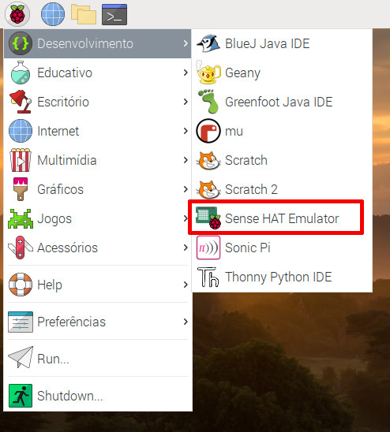

Se você não tiver acesso a um Sense HAT, poderá usar o emulador.

### Emulador Sense HAT Online

Existe um emulador online que você pode usar no seu navegador para escrever e testar o código para o Sense HAT.


+ Abra um navegador web, vá para [https://trinket.io/sense-hat](https://trinket.io/sense-hat){:target="_ blank"} e exclua o código de demonstração existente que está no editor.

+ Se você quiser salvar seu trabalho, precisará [criar uma conta gratuita](https://trinket.io/signup){:target="_ blank"} no site do Trinket.

### Emulador Sense HAT no Raspberry Pi

Se você estiver usando um Raspberry Pi, há um emulador Sense HAT incluído no sistema operacional Raspberry Pi OS (anteriormente chamado Raspbian).



+ No menu principal, selecione **Desenvolvimento** > **Sense HAT Emulator** para abrir uma janela contendo o emulador.

+ Se você estiver usando esta versão do emulador, seu programa deverá importar de `sense_emu` em vez de `sense_hat`:

```python
from sense_emu import SenseHat
```

Se você quiser executar posteriormente seu código em um Sense HAT de verdade, basta alterar a linha de import, como mostrado abaixo. Todo o resto do código pode permanecer exatamente igual.

```python
from sense_hat import SenseHat
```
